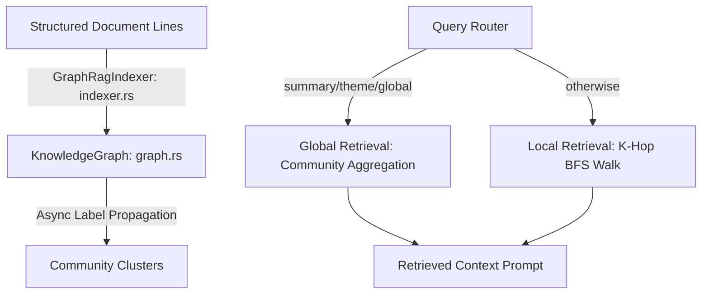

# Graph-RAG Engine (Rust)

A from-scratch, in-memory **knowledge-graph substrate** for a graph-RAG
(Retrieval-Augmented Generation) pipeline, written in Rust. It provides three
things, all implemented by hand with no graph/ML libraries:

1. A **knowledge graph**: entities (`id, name, type, description`) and weighted,
   directed relationships stored as an adjacency list.
2. **Community detection** via a deterministic, asynchronous **Label Propagation
   Algorithm (LPA)**, plus a from-scratch undirected weighted **modularity** `Q`.
3. **Multi-hop retrieval**: a k-bounded breadth-first graph walk that collects
   local context, and a community-based global-context aggregator.

Correctness is verified by a seeded property/differential test suite (see
*Verification* below), not by a single smoke test.

## What this is

- This is the graph substrate a RAG system would sit on top of. Retrieval is
  over this in-memory graph only: there is no production vector/graph
  database, no embedding model, and no LLM step. Document "ingestion" is a
  small structured-line parser, not entity extraction by a model.
- It is a solo, from-scratch, oracle-verified implementation of known
  techniques (Label Propagation, modularity, BFS), with limitations stated
  below. It is not "world-first", state-of-the-art, or production-grade.

## Architecture



- `src/graph.rs`: `KnowledgeGraph` with entity/relationship structs, undirected
  adjacency precompute, async LPA (`run_community_detection`), modularity
  (`modularity`, `modularity_of`), BFS retrieval (`multi_hop_search`,
  `bfs_reachable`), and community grouping (`communities`).
- `src/indexer.rs`: `GraphRagIndexer`, the structured-line parser and local/global
  query router.
- `src/lib.rs`: module declarations.
- `tests/graph_rag_test.rs`: end-to-end ingestion/retrieval smoke test.
- `tests/property_tests.rs`: the seeded property/differential suite.

## Community detection: deterministic async Label Propagation

Each node starts in its own community. On each sweep, every node (visited in a
deterministic, structure-decorrelated order) adopts the neighbor community with
the largest total incident edge weight, updating **in place** (asynchronous), so
the process converges instead of oscillating. Details:

- **Undirected**: a directed relationship `s -> t` contributes weight to both
  endpoints. The undirected weighted adjacency is precomputed **once per call in
  O(V + E)**, so each sweep is O(V + E), not the O(V·E) rescan-every-edge-per-node
  of a naive implementation.
- **Deterministic tie-break**: on equal total incident weight, the **smallest
  community label id** wins. This removes the dependence on `HashMap` iteration
  order that makes a naive LPA non-reproducible.
- **Sweep order**: nodes are updated in the order given by a fixed FNV-1a hash of
  `(iteration, id)`. Reshuffling each sweep (and, crucially, *not* using raw id
  order) prevents any one densely-connected block from consolidating first and
  then swallowing the rest into a single "monster community". This is the role
  randomized async order plays in the LPA literature, done here as a pure function
  of the graph so runs stay reproducible.
- **Termination**: stops when a full sweep changes no label, or after
  `max_iterations` sweeps.

### Limitations (important)

LPA is a **heuristic** with **no global-optimum guarantee**. Concretely:

- It has a **resolution limit** and can **under-merge or over-merge** on fuzzy or
  weakly-separated community structure. In particular, once two communities are
  linked by more than a handful of bridge edges, LPA tends to merge them
  **all-or-nothing**.
- It reliably recovers only **well-separated** communities. Quantified on planted
  stochastic-block-model graphs (2–3 blocks of 15–25 nodes, intra-block edge prob
  `0.9`, inter-block `0.001`): **39/40 graphs = 97.5% recovered** at ≥ 0.90
  best-match accuracy (mean accuracy 0.988) at the test seed; across five
  independent base seeds the rate was **0.975–1.000**. As inter-block density
  rises, recovery degrades sharply (e.g. at inter-block prob `0.05` the graph
  collapses into one community; see the tuning note in the SBM test).
- Deterministic async ordering fixes **reproducibility**, not **optimality**: the
  same graph always yields the same partition, but that partition is still only a
  local heuristic result.

## Design

Determinism and Label Propagation are in direct conflict: LPA is randomized on purpose, because
random async order is what stops the sweep from correlating with the structure it is looking
for. Removing the randomness the obvious way — sweeping in sorted id order — produces a
reproducibly *bad* partition, since sorted ids group structurally related nodes contiguously and
the first consolidated block becomes an attractor that swallows the graph. Hashing the sweep
order buys back the decorrelation without buying back the randomness. Why the tie-break rule is
load-bearing rather than stylistic, and why the test constructs input families where community
detection has a defined answer at all, are in [docs/DESIGN.md](docs/DESIGN.md).

## Verification

`tests/property_tests.rs` uses a hand-rolled seeded xorshift64\* PRNG, so every
run is byte-for-byte reproducible; no test reads the system RNG, clock, or
environment. Coverage:

1. **Determinism.** Same graph + same seed produces the byte-identical partition
   on repeated runs, and re-running detection is idempotent (6 graphs).
2. **Disjoint cliques == connected components (exact oracle).** On random unions
   of 1–5 cliques (each size ≥ 3), LPA's partition equals an independent
   union-find connected-components reference *exactly*: two nodes share a label
   **iff** they share a component, and every clique is monochromatic (60 graphs).
3. **Planted-partition recovery (probabilistic).** SBM graphs, permutation-invariant
   best-match accuracy vs. planted labels, asserting a success rate (not every
   graph): **39/40 = 0.975 ≥ 0.90** threshold (see numbers above).
4. **Modularity sanity.** LPA's final partition has `Q ≥ Q(singleton partition)`
   on random graphs; it never makes modularity worse (50 graphs).
5. **Multi-hop == reference BFS (exact differential).** `multi_hop_search`'s
   emitted entity set equals an independent k-bounded directed BFS reference
   over many random graphs, starts, and hop limits spanning below and above the
   graph diameter (240 cases).
6. **Anti-triviality guard.** Asserts the generated corpus actually includes
   multi-community graphs, cliques of varying size, disconnected graphs, and hop
   limits both below and above the diameter.

## How to run

```bash
cargo test                 # unit + property/differential suite
cargo clippy --all-targets # lint (warning-clean)
cargo fmt --check          # formatting
```

`serde` derives are kept so the graph remains (de)serializable.
